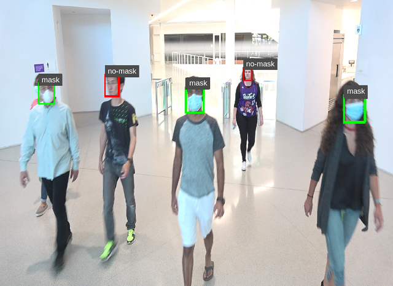

# face_mask_detection

[NVIDIA Developer Blog](https://developer.nvidia.com/blog/implementing-a-real-time-ai-based-face-mask-detector-application-for-covid-19/)

The project shows, tutorial for NVIDIA's Transfer Learning Toolkit (TLT) + DeepStream (DS) SDK ie training and inference flow for detecting faces with mask and without mask on Jetson Platform.

By the end of this project; you will be able to build DeepStream app on Jetson platform to detect faces with mask and without mask. 



### What this project includes
- Transfer Learning Toolkit (TLT) scripts:
	- Dataset processing script to convert it in KITTI format 
	- Specification files for configuring tlt-train, tlt-prune, tlt-evalute
- DeepStream (DS) scripts:
	- deepstream-app config files (For demo on single stream camera and detection on stored video file)

### What this project does not provide
- Trained model for face-mask detection; we will go through step by step to produce detetctnet_v2 (with ResNet18 backbone) model for face-mask detection.
- NVIDIA specific dataset for faces with and without mask; we suggest following dataset based on our experiments.


### Preferred Datasets
- Faces with Mask
	- Kaggle Medical Mask Dataset [Download Link](https://www.kaggle.com/ivandanilovich/medical-masks-dataset-images-tfrecords)
	- MAFA - MAsked FAces [Download Link](https://drive.google.com/drive/folders/1nbtM1n0--iZ3VVbNGhocxbnBGhMau_OG)
- Faces without Mask
	- FDDB Dataset [Download Link](http://vis-www.cs.umass.edu/fddb/)
	- WiderFace Dataset [Download Link](http://shuoyang1213.me/WIDERFACE/)

*Note: We do not use all the images from MAFA and WiderFace. Combining we will use about 6000 faces each with and without mask*

## Steps to perform Face Detection with Mask:

- Install dependencies and Docker Container <br/>
  - On Training Machine with NVIDIA GPU:
      - Install NVIDIA Docker Container: [installation instructions](https://developer.nvidia.com/blog/gpu-containers-runtime/) [TLT Toolkit Requirements](https://docs.nvidia.com/metropolis/TLT/tlt-getting-started-guide/index.html#requirements) <br/>
      - [Running Transfer Learning Toolkit using Docker](https://ngc.nvidia.com/catalog/containers/nvidia:tlt-streamanalytics)
          - Pull docker container:<br/>
              ```docker pull nvcr.io/nvidia/tlt-streamanalytics:v2.0_py3```
          - Run the docker image:
              ```
              docker run --gpus all -it -v "/path/to/dir/on/host":"/path/to/dir/in/docker" \
                            -p 8888:8888 nvcr.io/nvidia/tlt-streamanalytics:v2.0_py3 /bin/bash
              ```
      - Clone Git repo in TLT container:
          ```
          git clone https://github.com/NVIDIA-AI-IOT/face-mask-detection.git
          ```
      - Install data conversion dependencies
          ```
          cd face-mask-detection
          python3 -m pip install -r requirements.txt
          ```
  - On NVIDIA Jetson:
      - [Install DeepStream](https://docs.nvidia.com/metropolis/deepstream/dev-guide/index.html#page/DeepStream_Development_Guide/deepstream_quick_start.html#wwpID0E0GI0HA)

- Prepare input data set (On training machine)
    - We expect downloaded data in [this](https://github.com/NVIDIA-AI-IOT/face-mask-detection/blob/master/data_utils/data-tree.txt) structure.
    - Convert data set to KITTI format
      ``` cd face-mask-detection ``` <br/>
      ```
      python3 data2kitti.py --kaggle-dataset-path <kaggle dataset absolute directory path> \
                               --mafa-dataset-path <mafa dataset absolute  directory path> \
                               --fddb-dataset-path < FDDB dataset absolute  directory path> \
                               --widerface-dataset-path <widerface dataset absolute  directory path> \
                               --kitti-base-path < Out directory for storing KITTI formatted annotations > \
                               --category-limit < Category Limit for Masked and No-Mask Faces > \
                               --tlt-input-dims_width < tlt input width > \
                               --tlt-input-dims_height <tlt input height > \
                               --train < for generating training dataset >
        ```

      You will see following output log:<br/>

      ```
        Kaggle Dataset: Total Mask faces: 4154 and No-Mask faces:790
        Total Mask Labelled:4154 and No-Mask Labelled:790

        MAFA Dataset: Total Mask faces: 1846 and No-Mask faces:232
        Total Mask Labelled:6000 and No-Mask Labelled:1022

        FDDB Dataset: Mask Labelled:0 and No-Mask Labelled:2845
        Total Mask Labelled:6000 and No-Mask Labelled:3867

        WideFace: Total Mask Labelled:0 and No-Mask Labelled:2134
        ----------------------------
        Final: Total Mask Labelled:6000
        Total No-Mask Labelled:6001
        ----------------------------
      ```
   *Note: You might get warnings; you can safely ignore it*

    
- Perform training using [TLT training flow](https://github.com/NVIDIA-AI-IOT/face-mask-detection#nvidia-transfer-learning-toolkit-tlt-training-flow-)
    - Use ['face-mask-detection'](https://github.com/NVIDIA-AI-IOT/face-mask-detection/blob/master/face-mask-detection.ipynb) Jupyter Notebook provided with this repository. 
    - Follow TLT training flow

- Perform inference using DeepStream SDK on Jetson
    - Transfer model files (.etlt), if int8: calibration file (calibration.bin)
    - Use config files from ```/ds_configs/*```
        ``` $vi config_infer_primary_masknet.txt```
        - Modify model and label paths: according to your directory locations<br/>
            - Look for ``` tlt-encoded-model, labelfile-path, model-engine-file, int8-calib-file ``` <br/>
        - Modify confidence_threshold, class-attributes according to training
            - Look for ``` classifier-threshold, class-attrs ```
    - Use ``` deepstream_config ``` files:
        ``` $ vi deepstream_app_source1_masknet.txt ```
        - Modify model file and config file paths:
            - Look for ``` model-engine-file, config-file ``` under ```primary-gie```
    - Use deepstream-app to deploy in real-time
          ```$deepstream-app -c deepstream_app_source1_video_masknet_gpu.txt```<br/>
    - We provide two different config files:
        - DS running on GPU only with camera input: ```deepstream_app_source1__camera_masknet_gpu.txt ```
        - DS running on GPU only with saved video input: ```deepstream_app_source1_video_masknet_gpu.txt ```


*Note:*<br>
    - ```model-engine-file``` is generated at first run; once done you can locate it in same directory as ```.etlt```
    - In case you want to generate ```model-engine-file``` before first run; use [tlt-converter](https://docs.nvidia.com/metropolis/TLT/tlt-getting-started-guide/index.html#gen_eng_tlt_converter)


## Evaluation Results on NVIDIA Jetson Platform

<table cellspacing="0" border="0">
	<colgroup span="7" width="107"></colgroup>
	<tr>
		<td style="border-top: 1px solid #000000; border-bottom: 1px solid #000000; border-left: 1px solid #000000; border-right: 1px solid #000000" rowspan=2 height="100" align="center" valign=middle bgcolor="#76B900"><b><font color="#000000">Pruned</font></b></td>
		<td style="border-top: 1px solid #000000; border-bottom: 1px solid #000000; border-left: 1px solid #000000; border-right: 1px solid #000000" rowspan=2 align="center" valign=middle bgcolor="#76B900"><b><font color="#000000">mAP       (Mask/No-Mask)<br>(%)</font></b></td>
		<td style="border-top: 1px solid #000000; border-bottom: 1px solid #000000; border-left: 1px solid #000000; border-right: 1px solid #000000" align="center" valign=middle bgcolor="#76B900"><b><font color="#000000">Inference Evaluations on Nano</font></b></td>
		<td style="border-top: 1px solid #000000; border-bottom: 1px solid #000000; border-left: 1px solid #000000; border-right: 1px solid #000000" colspan=2 align="center" valign=middle bgcolor="#76B900"><b><font color="#000000">Inference Evaluations on Xavier NX</font></b></td>
		<td style="border-top: 1px solid #000000; border-bottom: 1px solid #000000; border-left: 1px solid #000000; border-right: 1px solid #000000" colspan=2 align="center" valign=middle bgcolor="#76B900"><b><font color="#000000">Inference Evaluations on Xavier</font></b></td>
		</tr>
	<tr>
		<td style="border-top: 1px solid #000000; border-bottom: 1px solid #000000; border-left: 1px solid #000000; border-right: 1px solid #000000" align="center" valign=middle bgcolor="#76B900"><b><font color="#000000">GPU<br>(FPS)</font></b></td>
		<td style="border-top: 1px solid #000000; border-bottom: 1px solid #000000; border-left: 1px solid #000000; border-right: 1px solid #000000" align="center" valign=middle bgcolor="#76B900"><b><font color="#000000">GPU<br>(FPS)</font></b></td>
		<td style="border-top: 1px solid #000000; border-bottom: 1px solid #000000; border-left: 1px solid #000000; border-right: 1px solid #000000" align="center" valign=middle bgcolor="#76B900"><b><font color="#000000">DLA<br>(FPS)</font></b></td>
		<td style="border-top: 1px solid #000000; border-bottom: 1px solid #000000; border-left: 1px solid #000000; border-right: 1px solid #000000" align="center" valign=middle bgcolor="#76B900"><b><font color="#000000">GPU<br>(FPS)</font></b></td>
		<td style="border-top: 1px solid #000000; border-bottom: 1px solid #000000; border-left: 1px solid #000000; border-right: 1px solid #000000" align="center" valign=middle bgcolor="#76B900"><b><font color="#000000">DLA<br>(FPS)</font></b></td>
	</tr>
	<tr>
		<td style="border-top: 1px solid #000000; border-bottom: 1px solid #000000; border-left: 1px solid #000000; border-right: 1px solid #000000" height="38" align="center" valign=middle><font color="#000000">No</font></td>
		<td style="border-top: 1px solid #000000; border-bottom: 1px solid #000000; border-left: 1px solid #000000; border-right: 1px solid #000000" align="center" valign=middle><font color="#000000">86.12 (87.59, 84.65)</font></td>
		<td style="border-top: 1px solid #000000; border-bottom: 1px solid #000000; border-left: 1px solid #000000; border-right: 1px solid #000000" align="center" valign=middle sdval="6.5" sdnum="1033;"><font color="#000000">6.5</font></td>
		<td style="border-top: 1px solid #000000; border-bottom: 1px solid #000000; border-left: 1px solid #000000; border-right: 1px solid #000000" align="center" valign=middle sdval="125.36" sdnum="1033;"><font color="#000000">125.36</font></td>
		<td style="border-top: 1px solid #000000; border-bottom: 1px solid #000000; border-left: 1px solid #000000; border-right: 1px solid #000000" align="center" valign=middle sdval="30.31" sdnum="1033;"><font color="#000000">30.31</font></td>
		<td style="border-top: 1px solid #000000; border-bottom: 1px solid #000000; border-left: 1px solid #000000; border-right: 1px solid #000000" align="center" valign=middle sdval="269.04" sdnum="1033;"><font color="#000000">269.04</font></td>
		<td style="border-top: 1px solid #000000; border-bottom: 1px solid #000000; border-left: 1px solid #000000; border-right: 1px solid #000000" align="center" valign=middle sdval="61.96" sdnum="1033;"><font color="#000000">61.96</font></td>
	</tr>
	<tr>
		<td style="border-top: 1px solid #000000; border-bottom: 1px solid #000000; border-left: 1px solid #000000; border-right: 1px solid #000000" height="38" align="center" valign=middle><font color="#000000">Yes (12%**)</font></td>
		<td style="border-top: 1px solid #000000; border-bottom: 1px solid #000000; border-left: 1px solid #000000; border-right: 1px solid #000000" align="center" valign=middle><font color="#000000">85.50 (86.72, 84.27)</font></td>
		<td style="border-top: 1px solid #000000; border-bottom: 1px solid #000000; border-left: 1px solid #000000; border-right: 1px solid #000000" align="center" valign=middle sdval="21.25" sdnum="1033;"><font color="#000000">21.25</font></td>
		<td style="border-top: 1px solid #000000; border-bottom: 1px solid #000000; border-left: 1px solid #000000; border-right: 1px solid #000000" align="center" valign=middle sdval="279" sdnum="1033;"><font color="#000000">279</font></td>
		<td style="border-top: 1px solid #000000; border-bottom: 1px solid #000000; border-left: 1px solid #000000; border-right: 1px solid #000000" align="center" valign=middle sdval="116.2" sdnum="1033;"><font color="#000000">116.2</font></td>
		<td style="border-top: 1px solid #000000; border-bottom: 1px solid #000000; border-left: 1px solid #000000; border-right: 1px solid #000000" align="center" valign=middle sdval="508.32" sdnum="1033;"><font color="#000000">508.32</font></td>
		<td style="border-top: 1px solid #000000; border-bottom: 1px solid #000000; border-left: 1px solid #000000; border-right: 1px solid #000000" align="center" valign=middle sdval="155.5" sdnum="1033;"><font color="#000000">155.5</font></td>
	</tr>
</table>

## NVIDIA Transfer Learning Toolkit (TLT) Training Flow <br/>
1. Download Pre-trained model ( For Mask Detection application, we have experimented with Detectnet_v2 with ResNet18 backbone)
2. Convert dataset to KITTI format
3. Train Model (tlt-train)
4. Evaluate on validation data or infer on test images (tlt-evaluate,  tlt-infer)
5. Prune trained model (tlt-prune)<br/>
   Pruning model will help you to reduce parameter count thus improving FPS performance
6. Retrain pruned model (tlt-train)
7. Evaluate re-trained model on validation data (tlt-evaluate)
8. If accuracy does not fall below satisfactory range in (7); perform step (5), (6), (7); else go to step (9)
9. Export trained model from step (6) (tlt-export)<br/>
   Choose int8, fp16 based on you platform needs; such as Jetson Xavier and Jetson Xavier-NX has int8 DLA support

### Interesting Resources
- [Transfer Learning Toolkit (TLT) Getting Started](https://developer.nvidia.com/tlt-getting-started)
- [Pruning Models with NVIDIA Transfer Learning Toolkit](https://developer.nvidia.com/blog/transfer-learning-toolkit-pruning-intelligent-video-analytics/)

### References
- Evan Danilovich (2020 March). Medical Masks Dataset. Version 1. Retrieved May 14, 2020 from https://www.kaggle.com/ivandanilovich/medical-masks-dataset
- Shiming Ge, Jia Li, Qiting Ye, Zhao Luo; "Detecting Masked Faces in the Wild With LLE-CNNs", Proceedings of the IEEE Conference on Computer Vision and Pattern Recognition (CVPR), 2017, pp. 2682-2690
- Vidit Jain and Erik Learned-Miller. "FDDB: A Benchmark for Face Detection in Unconstrained Settings". Technical Report UM-CS-2010-009, Dept. of Computer Science, University of Massachusetts, Amherst. 2010
- Yang, Shuo and Luo, Ping and Loy, Chen Change and Tang, Xiaoou; "WIDER FACE: A Face Detection Benchmark", IEEE Conference on Computer Vision and Pattern Recognition (CVPR),2016
- MAFA Dataset Google Link: Courtesy [aome510](https://github.com/aome510/Mask-Classifier)

